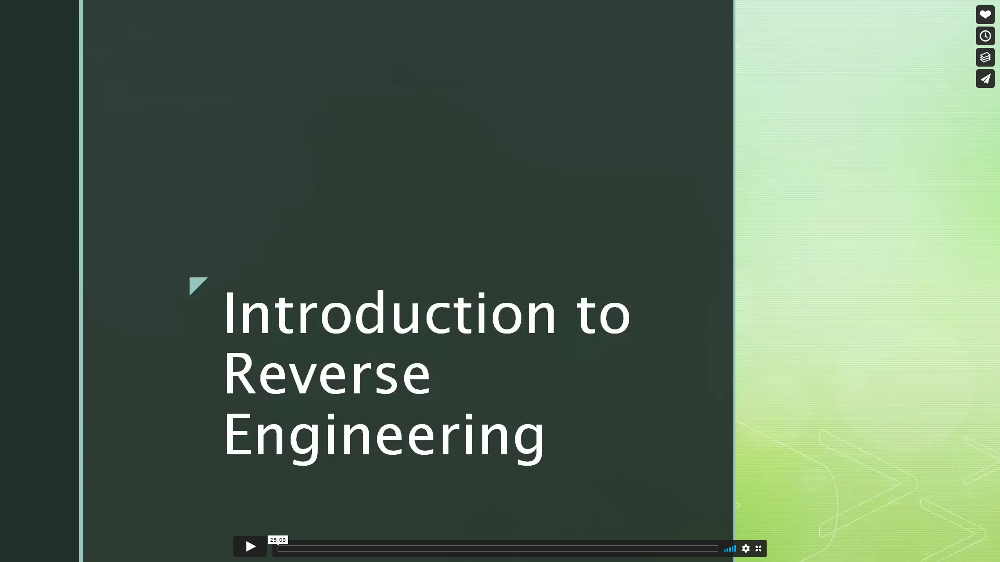

# CSOC Week-4
This is a list of resources and challenges to learn and practice your reverse engineering skills for CTF's.
## Resources / Tools

**Check out our video**

**Presentation can be found here**\
[Link](resources/CSOC_REV_PART_I.pdf)

## Writeups
Some list of writeups for you to enjoy.

[Very Simple .Net Crackme](https://medium.com/syscall59/reverse-engineering-solving-my-first-net-crackme-dacf2e59ad3b)\
[Beating a trial on a .net crackme using dnSpy](https://infosecwriteups.com/reverse-engineering-beating-a-trial-on-a-net-crackme-d4ab6604f10b)\
[Is it a Flag?](https://gitea.iitdh.ac.in/180010027/CTFlearn-Writeups/src/commit/53fd30619d84ed7ac46c3490fe376d9558313327/Programming/Is%20it%20the%20Flag_%20%28JAVA%29)\
[Morty's Sherlocked Writeup](https://medium.com/swlh/morty-sherlocked-android-application-ctf-challenge-walkthrough-ab1ec2161cb4)
## Challenges
**.NET**\
http://crackmes.one/crackme/5ab77f6433c5d40ad448cb21
http://crackmes.one/crackme/5ca5c1ac33c5d4419da556de
http://crackmes.one/crackme/5ab77f6633c5d40ad448cc4b

**python**\
http://crackmes.one/crackme/5ab77f5933c5d40ad448c43d \
https://github.com/IIT-BHU-CyberSec/Technex-CTF-2021/blob/main/rev/marshal/2test.py \
(Hint : python version 3.6.9 was used)

**java**\
http://crackmes.one/crackme/5ab77f5333c5d40ad448c0d9
http://crackmes.one/crackme/5ab77f5e33c5d40ad448c794
http://crackmes.one/crackme/5ab77f5f33c5d40ad448c7f8

**apk**\
https://ctflearn.com/challenge/962 \
https://github.com/lucideus-repo/cybergym/tree/master/cybergym1/mobile

